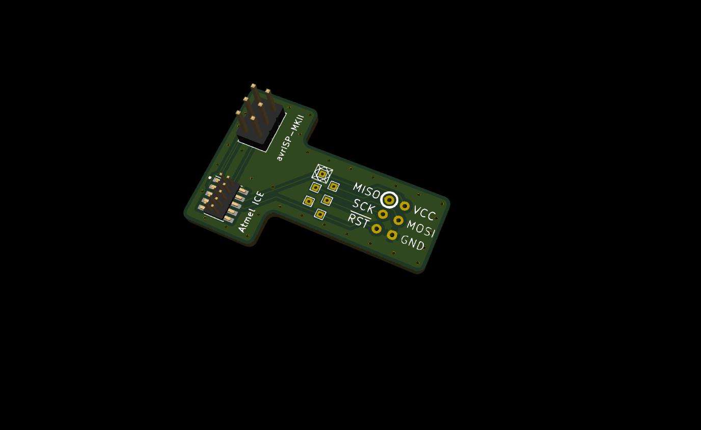

# avrisp-pogopin-adapter

This board is a pogo-pin adapter for the AVR ISP programming interface. This adapter allows a 10pin (1.27mm pitch) connection from the Atmel ICE squid cable or the 6pin (2.54mm pitch) ISP connection from a AVR-ISP MKII programmer. Both connectors are routed to a 2.54mm pitch 2x3 header where pogo-pins are solered. This allows the developer to press the pogo-pins onto a 2.54mm ISP header on their target, program the board, and then remove the connection. Leaving no tall headers on the final product that must be designed around.

